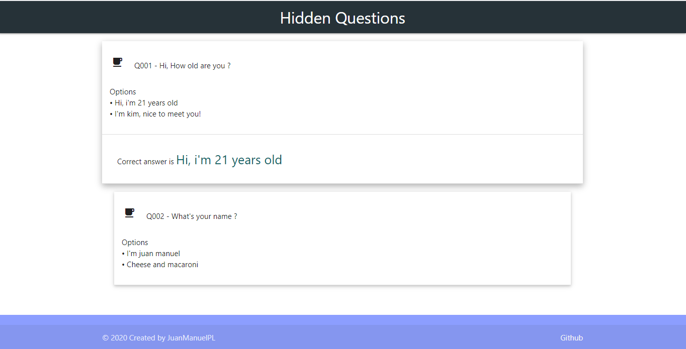

# Hidden Questions

_Disfruté mucho haciendo esta pequeña aplicación para memorizar preguntas, estas vienen de un json y en el proyecto se encuentra un ejemplo de la estructura de dicho archivo._

## Autor ✒️

* **Juan Manuel PL** - *Trabajo Inicial* - [JuanManuelPL](https://github.com/JuanManuelPL) 

---
⌨️ con ❤️ por [JuanManuelPL](https://github.com/JuanManuelPL) 

